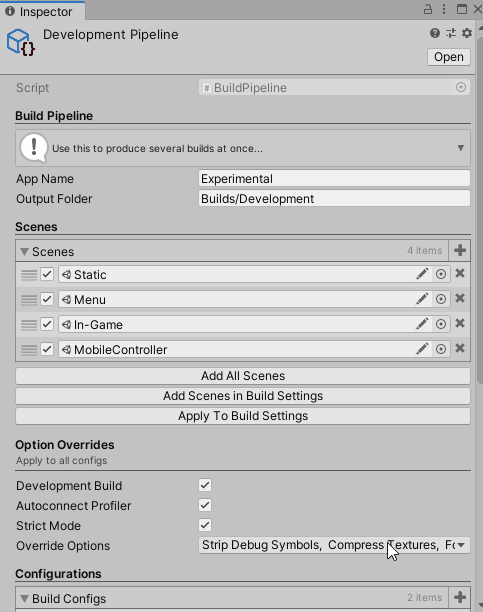

# A Build Pipeline for Unity using Odin Inspector

Automate multiple builds to different platforms in a friendly inspector. For developers deploying to multiple platforms wanting an advanced time-saving build pipeline. All with one scriptable object.



Example file tree produced with **one scriptable object per pipeline**:

- `Builds/Development`  *Pipeline 1*
  - `build 01-01-2020`  *One run of the pipeline*
    - `win64 `  *One build*
    - `android`
    - `build-log.txt`
  - `build 02-02-2020` ...
- `Builds/Production` *Pipeline 2*
  - `build 01-01-2020`
    - `win64`
    - `win32`
    - `osx`
    - `android`

## Getting started

1. Copy the two `.cs` scripts into somewhere your `Assets/Editor` folder
2. Create a Build Pipeline instance `Assets > Create > Build Pipeline` which will store all the information for one pipeline
3. Edit the settings in the Inspector, use the tooltips provided
   1. Choose where you want builds to be saved for this pipeline relative to the project root
   2. Add the scenes you want included
   3. Choose the options you want for all builds in the overrides
   4. Add the list of platforms you want to build to in the build configs
4. Click Build All

**Tips**

- Scenes and build configurations can be deactivated
- You can use `/`'s in the paths and names to add more subdirectories

## Advanced Features

**Callbacks & Customization**

In the `BuildPipelineCustomization.cs` script you can add your own callbacks as well as modify the naming of your builds.

**Multi-pipeline & Shortcuts**

Multiple Build Pipeline instances can be created and run individually. However, a pipeline can also be added to a pipeline group. *A group of pipelines can be triggered* via `Tools > Build Pipeline` or preferably via the shortcuts defined in `Edit > Shortcuts > Build`. This makes the shortcuts work like events triggering a set pipelines. This grouping functionality could be used to create a *development* and *production* pipeline which are triggered together.

**Logging & Progress**

As Unity's UI is very unresponsive and infrequently repainted when building, the exact progress of the pipeline can be seen in a log file `build-log.txt` inside the output folder. The callbacks can also choose to log further details with a `StreamWriter`.

**Command-line**

A static function is provided to enable building from the command-line in [batchmode](https://docs.unity3d.com/Manual/CommandLineArguments.html). This could be used in a CI/CD script for further automation on a server. Note the argument `-buildPipeline <path/to/pipeline.asset>` being the desired pipeline to run. Alternatively a group can be triggered as shown using `groupId` as an integer `0,1,2`.

```bash
#Example CMD usage
"C:\Program Files\Unity\Hub\Editor\2019.3.0f6\Editor\Unity.exe" -quit -batchmode -projectPath 
Path\To\Project -executeMethod RogerBarton.BuildPipeline.BuildAll 
-buildPipeline "Assets/Editor/Production Build Pipeline.asset" -logfile unityBuildLog.txt
#Trigger a Pipeline Group
Unity.exe ... -executeMethod RogerBarton.BuildPipeline.BuildPipelineGroup -pipelineGroup <groupId>
```

## Sample Project

A basic sample project [UnityBuildPipelineSample is available here](https://github.com/rogerbarton/UnityBuildPipelineSample)

Tested with Odin Inspector 2.1.9 and Unity 2019.3.0f6, 2019.2.21f1, 2018.4.17f1 (LTS), 2018.3.9f1, *no shortcuts in 2018.x*

## Known Issues

- Currently Odin will sometimes generate errors relating to drawing the UI after a build. These have no effect and can be ignored while a solution is being found. `InvalidOperationException: Stack empty.` and `Pop call mismatch`
- 'Try Add Current Build Settings' will fail if the project has never been built before (a build path has to be set)

*Note: The Odin Inspector asset is required*